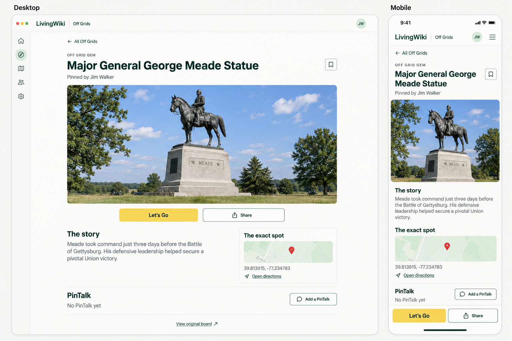

# Off Grids: center-stage detail and loading plan

Design proposal, September 16, 2026. Application code has not been changed.

The photograph and shortened story in this picture are illustrative. Implementation will use the gem's stored image and complete stored text, existing navigation, and authorized actions. The selected example currently has no PinTalk; the mockup reflects that. Contribution and edit controls remain conditional on server permissions.

## Diagnosis

The selected item is deliberately rendered as a desktop sidebar today. Both directory and detail URLs load OffGridsComponent in app.routes.ts. The template always renders the directory and adds an aside for the selected gem. The has-detail CSS gives that aside a roughly 330–440 px column and a sticky, independently scrolling container. Below 760 px, CSS hides the directory, but that only changes visibility; the directory still loads.

The public share handler emits social metadata and redirects people to /off-grids/:spotId. That destination uses the same two-column component. Fixing that route fixes clicks and shared-link landings together; existing gem IDs and share URLs can remain valid.

There is also identifiable redundant work:
- The component constructor calls load() even on a direct gem URL.
- Session restoration can call loadDetail() again after an initial detail has already completed.
- The service combines simultaneous directory requests but does not combine simultaneous detail requests.
- The directory advertises a fixed 400 px image slot and only 600w/1600w sources. Depending on viewport and pixel density, the browser can choose a 1600 px image for a much smaller card. Confirm actual currentSrc and response bytes before changing renditions.
- The backend detail path performs spot/source reads, a clips query, an authenticated media-grant write, and contribution checks in sequence. Contribution checking can read the source again.
- No always-on instances are configured. The previous investigation identified cold media workers as a real delay, and optimized module loading and image-byte caching already exist.

The user's approximately five-second full load has not been remeasured in this design pass. It should not be attributed entirely to a single cause. Previous recorded samples were roughly 0.35 s for a warm directory response, 1.23 s for its first response after deployment, and 1.53 s for a first optimized small cover. Those are individual historical samples, not current end-to-end measurements or guarantees.

## Proposed experience

Use a dedicated gem destination page for /off-grids/:spotId at every screen size.

Desktop:
- Retain the LivingWiki app header and global navigation.
- Center one gem within the remaining main content area, approximately 1,100 px maximum width with responsive gutters.
- Show All Off Grids, a proper H1, creator attribution, and Save.
- Show a dominant cover photograph, followed by Let's Go and Share.
- Place the complete story and access notes below; put a smaller exact-location section alongside the story when space allows.
- Place PinTalks below, featured clips first, with permission-based contribution and owner moderation controls.
- Keep View original board for imported gems.
- Use normal document scrolling. Remove the listing from the detail page and remove the nested detail scroll container.

Mobile:
- Use the same destination page, stacking title, cover, story, exact location, and PinTalks.
- Keep Let's Go and Share in a bottom action bar with safe-area padding and enough page padding to avoid covering content.
- Preserve the subject in portrait and landscape photos; use contained presentation where necessary rather than forcing every image into a destructive crop.
- Keep dark-theme support, readable wrapping for long titles, and 44 px controls.

Navigation:
- Clicking a grid card or map pin opens the destination URL.
- Shared URLs, reloads, and new tabs open that same centered experience.
- All Off Grids returns to the originating search, scope, grid/map mode, map bounds, loaded pages, and scroll position when that browse state is available.
- A direct external link has a reliable return to the normal directory, without depending on browser history.
- Browser Back/Forward works naturally. A new selection starts at the top; returning to browse restores its position.
- Loading, unavailable, private, and error states occupy the same centered page. A failed request must not leave the previous gem visible.

## Implementation sequence

### 1. Separate directory and detail responsibilities

Add a lazy OffGridDetailComponent for /off-grids/:spotId. Keep OffGridsComponent as the directory. Extract shared header/action-sheet presentation only where useful; avoid duplicating authentication, directions, sharing, recording, or moderation logic.

Move detail presentation and its existing workflows into the new component. Keep new/edit routes and existing share handlers valid. Preserve route title/description updates, public social previews, private media renewal, source-board navigation, and all existing server authorization.

Persist a bounded in-memory browse snapshot in the Off Grids service or a focused navigation-state service. Store filter/search/mode/cursor/pages/scroll/map state and the originating item. Scope private snapshots to the authenticated user and clear them on account changes. Record scroll before navigation and restore after rendering. Do not rely on a blanket route-reuse strategy.

### 2. Make route transitions feel immediate

Show a centered skeleton immediately on direct loads. For a click from an already loaded directory, carry the available title, creator, story snippet, and cover into the destination as a temporary preview while validating current detail access.

The preview is presentation data, never authority to reveal private clips, edit, contribute, or publish. Clear it on access failure or account changes. Avoid caching private preview data across users or in persistent browser storage.

Key requests by spot ID and authentication context. Combine simultaneous identical requests, retain the existing response-version protection, and ensure invalidation prevents late requests from refilling caches. Clear previous selection on route changes. Retry, clip changes, edits, and grant renewal must explicitly request fresh authoritative data.

Auth restoration should update permission-specific state deliberately. It must not blindly repeat a completed detail request with the same user context, and a private direct link must be retried after the authenticated session becomes ready rather than getting stuck in a guest error.

### 3. Measure and improve directory and photo loading

Record a before/after waterfall for:
- directory shell, first cards, first visible cover, and remaining visible covers;
- directory click to destination shell and validated detail;
- direct detail URL and public share redirect to destination;
- warm workers versus requests after inactivity;
- local development build versus the production build served locally.

Inspect endpoint duration, response bytes, currentSrc, image decode, authentication restoration, and requests initiated before useful content appears. Use browser network/paint measurements and server timings/logs, with credentials or media grants excluded from recorded artifacts.

Then:
- Correct responsive sizes to the actual card widths.
- Use an appropriate small/medium card rendition if measurements show 1600 px downloads are wasteful; reserve large renditions for the destination hero.
- Reserve image dimensions to prevent layout jumps.
- Give the destination hero high priority; use the already available small preview while the larger authorized photo arrives.
- Keep maps, recording, QR generation, and video streams out of the initial rendering path.
- Preserve the existing small worker module, visibility-checked byte cache, eager first card covers, anonymous directory endpoint, and bounded page cache.

Do not count all lazy off-screen images as a prerequisite for a usable page.

### 4. Shorten the detail server path if its measured latency warrants it

After current access is established, run independent clip, permission, and necessary grant work concurrently. Reuse the source visibility result within the request instead of rereading it during contribution checks.

Avoid writing a media grant when all returned assets are publicly accessible. Preserve grants for private gems and for owner/contributor media requiring protected access, including unapproved clips.

If callable/auth restoration remains on the critical public path, add a small anonymous GET detail endpoint for the currently public core: title, creator, story, cover, exact location, and public share metadata. Fetch user permissions and protected clips separately after session readiness. Share the authorization/projection helpers to prevent divergent behavior. Private direct links continue through the authenticated path.

Every public read and media response must keep the current spot/source-card visibility checks. Do not turn access-sensitive endpoints into broadly cached public responses.

Only if measurements show cold starts remain the dominant delay should we configure a minimum warm instance for the measured bottleneck. That has ongoing billing implications; it is a separate hosting decision after the cheaper changes have been assessed.

## Validation and completion criteria

Route and interaction checks:
- Grid and map selections open a centered destination; the directory is absent.
- Fresh /off-grids/:spotId loads never request a directory page.
- Copied social share links and direct application URLs land on the same centered page.
- Back/Forward and All Off Grids restore browse state; direct links return reliably.
- Session readiness does not cause duplicate requests with the same authentication context.
- Rapid A-to-B navigation cannot paint A over B; route errors clear stale previews.
- Slow, failed, deleted, private, and newly unpublished gems have usable centered states and retry/sign-in behavior.

Preserved workflows:
- Save/unsave, edit, original board navigation, exact-coordinate directions, native share/copy, QR, recording/upload/cancellation, clip approval/feature/removal, and private playback grant renewal.
- Owner and contributor permissions remain server-controlled.
- Account switch/logout clears private browse/detail state.
- Source becoming private/author-only/deleted still blocks public detail, media, and share responses.
- Authenticated pending clips are never exposed through the public path.

Presentation and accessibility:
- Verify 320/390 px mobile, tablet, 1440/1920 px desktop, light/dark themes, portrait/no-image covers, long titles/stories, and multiple clips.
- One page H1; focus moves to the destination heading on navigation and returns appropriately to the originating card.
- Keyboard action sheets retain focus trapping and Escape behavior.
- The mobile action bar never obscures content or keyboard controls. Reduced-motion settings are respected.

Use focused router/component/service tests for route selection, request counts, stale responses, auth transitions, and browse restoration. Extend backend integration tests only for changed read/grant logic, with public/private/source-revocation cases. Run existing Off Grids/media access tests, production build/bundle checks, and translation catalog checks.

Performance acceptance:
- A clicked gem with an available preview paints its destination shell and title within roughly 100–200 ms on the reference device.
- Target first directory content within one second on the agreed warm reference setup, and useful hero content within two seconds for a warm direct load.
- Record cold timings separately and compare multiple runs, rather than presenting one warm result as typical.
- Confirm reduced critical requests/bytes and no initial video/map/recording downloads.

These are implementation targets to verify against a recorded baseline, not promised timings across all devices and networks.

## Files expected to change when implementation is authorized

- src/app/app.routes.ts: route the gem URL to the dedicated detail component.
- src/app/off-grids/off-grids.ts/html/css: directory-only behavior and preview/navigation handoff.
- New src/app/off-grids/off-grid-detail.ts/html/css: centered destination and preserved detail workflows.
- src/app/off-grids/off-grid.service.ts: request coordination, bounded browse state, and targeted invalidation.
- Focused Off Grids specs and translation catalogs for new text.
- functions/src/off-grids/index.ts and related helpers/tests only for measured server improvements.
- Media rendition helpers only if the image waterfall justifies a medium rendition.

Deliver the centered page and cheap request/image improvements first. Assess the server changes against the measured residual delay. No application code or deployment was changed during this proposal.

