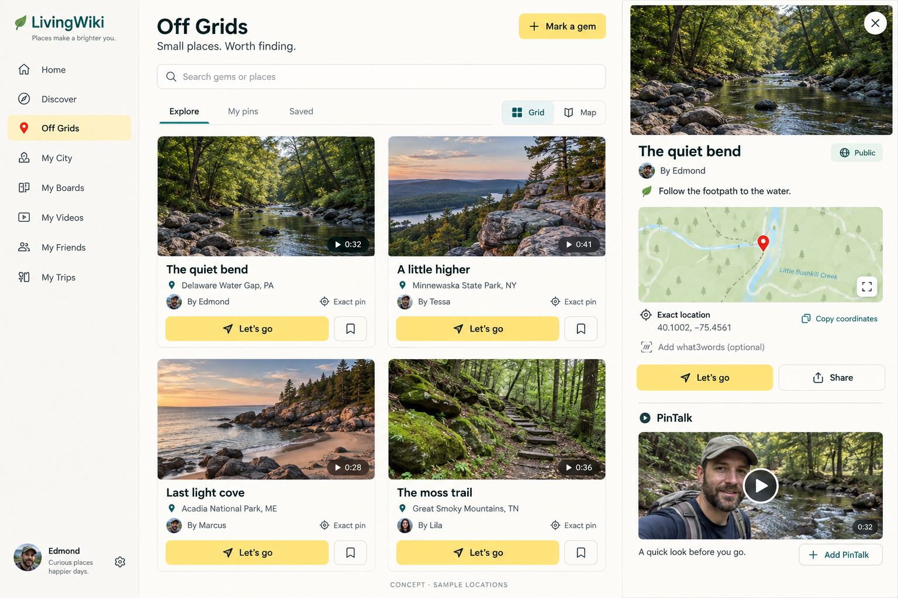
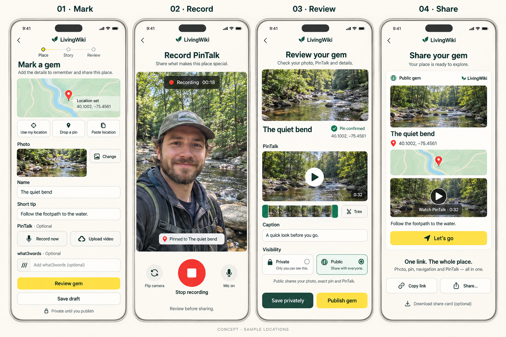

# Off Grids + PinTalk

Design and implementation proposal · 16 September 2026

**A gem is a place with a photo, a confirmed geographic pin, a useful tip, and optional PinTalk videos. Off Grids becomes its own page and sidebar item.** The creation action is **Mark a gem**; the navigation action is **Let’s go**; video is called **PinTalk** throughout the new experience.

This proposal includes generated visual concepts. They show sample photography, people, maps, and locations; they are not production screenshots or verified destination data. Implementation should reuse LivingWiki’s actual crane/wordmark, theme tokens, icons, and account photos.

## 1. Product decisions

| Piece | Proposed behavior |
| --- | --- |
| Sidebar | **Off Grids**, with a pin icon immediately after Discover. Works in the existing sidebar and mobile navigation. |
| Directory | `/off-grids`: **Explore**, **My pins**, **Saved**, search, and **Grid / Map**. One card per gem, even when several gems belong to one board. Explore includes the viewer’s own public gems. |
| Gem page | `/off-grids/:spotId`: cover photo, tip, creator, exact point, coordinates, optional what3words, **Let’s go**, **Share**, and PinTalk. Public gems work without signing in. |
| Create | `/off-grids/new`: choose a pin, add a photo/name/tip, optionally add PinTalk, review, then save privately or explicitly publish. |
| Location | Latitude and longitude are required for every active gem. what3words is optional. Missing locations are allowed only in incomplete drafts. |
| Video | **Record now** captures camera and microphone in the app, then opens review. **Upload video** uses an existing file and enters the same review/upload path. Both preserve the cover photo. |
| Sharing | One public gem URL contains the photo, exact point, navigation, and available PinTalks. Copy link/native Share are primary; download a share card is secondary. Sharing a private gem first offers a clear Publish flow. |
| Contributions | A gem supports multiple PinTalks. Initially preserve accepted-friend eligibility. A friend submits a clip for owner approval; the submission does not edit the gem’s coordinates, photo, or another person’s video. Broader community submissions are a later explicit setting. |
| Privacy | New gems and media start private. Publishing explicitly shares the exact coordinates, photo, tip, and selected ready videos. Existing private boards/cards never become public through aggregation. |

“Record now” means recording a clip at that moment and reviewing it before publication. It does not broadcast live. A live broadcast would need a separate product and delivery design.

## 2. Visual direction and screens

Use warm white surfaces, forest-colored text, yellow primary actions, quiet teal selection, and a red pin. Let photography lead. Keep existing dark-mode support through the app’s theme tokens. Use a consistent card ratio, soft 14–16px corners, restrained borders, readable text, and little decoration.

### Directory

- Header: **Off Grids** and **Mark a gem**. Search below the header; scope tabs below search.
- A gem card shows its photo, title, nearby area, creator, confirmed-pin indicator, save control, and **Let’s go**. A PinTalk badge shows a play icon and duration when a ready clip exists.
- Desktop uses a responsive grid; selecting a card opens a detail panel with a URL. Opening that URL directly gives a complete detail page. At narrow widths, use a full page rather than squeezing a panel beside the grid.
- Map view uses the same filters and a real basemap with clustered pins. Selecting a pin highlights its gem. Fetch only the viewport’s gems, not every board.
- No distance claims or automatic location prompt on entry. **Near me** can request location after a deliberate click. If declined, browsing and manual map selection still work.

### Mark a gem

A short three-step editor: **Place → Story → Review**.

1. **Place:** Use my location, Drop a pin, or Paste location. Accept numeric coordinates, a supported Maps URL, or a what3words address. Resolve inputs to the same latitude/longitude fields. Unsupported shortened Maps URLs get a clear request to select the point on the map or paste coordinates; do not guess.
2. Show the point on a map and let the user move it. Display GPS accuracy when available. **Confirm this pin** is required; GPS accuracy and a manually confirmed point are different concepts.
3. **Story:** Take/upload a cover photo, name the gem, add a brief useful tip. PinTalk is optional, with **Record now** and **Upload video** side by side.
4. **Review:** Show the exact shared-page preview. Visibility begins **Private**. **Save privately** keeps it personal; **Publish gem** asks the user to deliberately select Public and shows what will be shared. No automatic publication because a board or previous draft was public.

Incomplete work can be **Save draft**. An active private gem still needs a valid point. Add accessibility, seasonal/access notes as optional details rather than another mandatory step.

### PinTalk capture and review

- Camera: portrait/landscape preview, record/stop, elapsed time, camera switch, microphone toggle, and the gem name. Request camera/microphone only when Record now is clicked.
- Stop recording → local playback → trim start/end, optional caption, retry/remove, and save. Keep recording local until the user accepts it for upload.
- Upload uses the same preview and trim flow. Show progress, cancel, retry, and processing state. Do not make a recording public while it is uploading.
- Proposed launch limits: recordings up to 90 seconds; uploaded files up to 3 minutes and under the existing 100 MB limit. Validate actual duration and decoded media on the server. Existing valid clips are retained even if longer than the new capture target.
- Normalize accepted originals to a broadly playable MP4 rendition and poster. Keep the original private for reprocessing. Use browser-supported recording types, not a fixed WebM assumption. An unsupported browser falls back to native capture/file upload.
- Detail page shows the owner’s featured PinTalk first, then approved contributions. No autoplay or video downloading in the directory; fetch video only after Play.
- For friend contributions, review ends in **Submit PinTalk**, with a visible Pending approval state. The owner can approve/hide contributions and choose the featured clip. A contributor can manage their own clip, not other people’s content.

### Share and Let’s go

- Public sharing gives `/off-grids/:spotId`, a photo-first social preview, Copy link, native Share when available, and an optional downloadable image card/QR.
- The recipient page keeps photo, tip, map point, PinTalk, and **Let’s go** together. Social apps cannot be assumed to embed or attach a playable video from a pasted URL. A separate **Share video file** option is conditional on file-sharing support and includes the gem URL when the receiving app supports it.
- **Let’s go** opens a small sheet with **Open directions**, **Copy coordinates**, and optional **Open what3words**. Generate directions from the exact saved point, never from the gem name or nearest business.
- Existing schedule/invite features can remain a secondary **Plan a visit** option. Opening directions must not require creating a visit plan.
- The point is a destination, not a promise of an accessible hiking route. An optional approach/parking note helps someone reach a remote gem.

## 3. What already exists

Repository inspection and a read-only data inventory found:

- Four `kind: off-grid` boards, all public, containing 17 visible cards.
- Fifteen cards with valid stored coordinates; two with a what3words address only; one with Talk Drop video.
- The board wizard already resolves what3words and produces `locationLat` / `locationLng`.
- `saveOffGridContribution()` and `buildOffGridContributionCard()` currently pass/store what3words but omit latitude and longitude. The backend checks address syntax rather than resolving it to a point.
- `TalkDropComponent` already supplies upload progress, cancel, remove, and playback. Its Record button is a file input with a capture hint; it is not an in-app recording interface.
- `visitDirectionsUrl()` already prefers coordinates. `go-there.ts` and the visit-plan backend are useful adapters.
- Board media currently uses a publicly readable Storage path. That path is unsuitable for new private gem drafts and pending contributions.

This inventory covers boards explicitly marked Off Grid. The migration must also audit cards tagged `off-grid` in other board kinds and legacy Off Grid imports before reporting the total complete.

## 4. Data and integration design

Use independent lazy-loaded Off Grid components and a small service. Do not extend the large boards component into another directory or scan full public boards during page loading.

### Records

| Record | Purpose and important fields |
| --- | --- |
| `off_grid_spots/{spotId}` | Private/owner-readable full gem: `ownerUid`, `creatorUid`, title, tip, cover asset, location, status, visibility, source reference, timestamps/version, contribution policy. |
| `off_grid_spots/{spotId}/pin_talks/{clipId}` | Multiple clips: contributor, private original asset path, playback asset path, poster, actual duration, caption, upload/processing status, approval state, timestamps. |
| `public_off_grid_spots/{spotId}` | Server-maintained compact directory preview: title, area, creator, optimized cover/srcset, GeoPoint/lat/lng, geohash, bounded search text, approved ready clip count and featured poster/duration. Only published, located, eligible gems exist here. |
| `users/{uid}/saved_off_grid_spots/{spotId}` | Saves are user-specific and separate from board saves. |

Location stores **numeric** `lat`, `lng`, a Firestore `GeoPoint`, geohash, source (`gps`, `map`, `coordinates`, `what3words`), confirmation timestamp, and optional measured accuracy. Optional what3words stores words and resolution metadata separately. Coordinates remain the navigation authority if a user later adjusts the pin; refresh or clear the old words when the point changes.

Validate finite coordinates and legal ranges on the server; zero is a valid coordinate. Never infer missing coordinates from a nearby town, photo subject, or title. A what3words-only entry must be resolved before becoming active. If the provider is unavailable, the user can use the map/coordinates instead.

### Existing cards and single authority

- Derive an imported gem ID deterministically from `(boardId, stable cardId)`. Run migration idempotently so reruns never multiply a card into several gems. Audit/repair missing stable card IDs separately.
- Import explicitly Off Grid cards: cards in Off Grid boards and cards tagged Off Grid. Do not turn every card with location metadata into an Off Grid gem.
- For imported gems, the original board/card remains authoritative for original content and visibility; the normalized spot record is a projection. Editing original fields routes through the board adapter. `sourceVersion` prevents older triggers overwriting a newer projection.
- Preserve the board owner’s management rights and credit `contributorUserId` where present. Do not silently transfer ownership to contributors.
- Standalone new gems use the spot document as authority. Adding one to a board stores a reference to the spot, rather than a second editable copy. Shared rendering/location helpers support both routes.
- Imported visibility is bounded by the source board and `authorOnly`. A private source has no public preview. Deleting/removing a source card removes its projection; unpublishing a board withdraws its gems from Explore and sharing.
- Map existing `talkDrop` to the first PinTalk clip without losing URLs or playback. Keep the old field readable during rollout; rename user-facing text without breaking older board records.

### Backend, media, and queries

- Authenticated callables create/update/publish gems, start/finalize clip uploads, submit/approve clips, and handle visibility. Make publish checks atomic and idempotent.
- A processing job generates an optimized cover, video rendition/poster, and the requested trim. The publish path validates asset ownership, decoded type, file size, duration, and readiness.
- Use a dedicated restricted Off Grid media namespace. Store object paths for private originals; issue authorized short-lived playback URLs or serve through an access-checking endpoint. Do not reuse permanent download-token URLs for private drafts.
- Public playback and preview images must also respond to unpublication. Remove the public projection atomically with visibility changes, invalidate managed public media access, and keep edge-cache lifetimes bounded. An async trigger by itself is not sufficient for immediate withdrawal.
- New public sharing pages provide server-rendered metadata/photo previews and signed-out access; private data never enters social metadata.
- Explore reads previews ordered by creation time with a cursor, initially 12 items. My pins queries the owner/creator scope and can show private gems/drafts. Include the viewer’s own public gems in Explore.
- Public map/nearby queries use indexed geographic bounds with actual distance filtering. Search uses bounded normalized preview fields; if global substring relevance becomes necessary, add a dedicated search index rather than crawling all boards.
- Cache previews briefly in memory, partitioned by user and scope. Update/invalidate after edit, publish, hide, and save. Cache expiry does not replace access checks on details/media.

## 5. Implementation sequence

| Phase | Concrete work | Exit condition |
| --- | --- | --- |
| 1 · Location foundation | Extract shared validators/directions adapters; fix the existing contribution payload and server resolution; move what3words calls behind a server proxy; add coordinate-first/manual-pin support. | Every newly saved active Off Grid card or gem has valid confirmed coordinates. what3words outages do not block coordinate entry. |
| 2 · Records + migration | Add spot/preview/clip schema, visibility rules, indexes, source synchronization, dry-run audit, deterministic migration, and private media handling. Resolve the two known what3words-only cards. | Eligible existing gems and the existing video are accounted for; unresolved items stay visible to their owner with **Set location**; no duplicate or newly public private records. |
| 3 · Page + sidebar | Add lazy `/off-grids` and `/off-grids/:spotId`, sidebar/mobile navigation, preview cards, scopes, saves, direct links, real map view, search, and exact-coordinate directions sheet. | All eligible public gems, including the viewer’s own, are reachable; private gems appear only in their authorized scope. |
| 4 · Mark a gem | Add `/off-grids/new` and edit routes, map confirmation, photo/name/tip, draft recovery, private default, and explicit review/publication. | A user can make a complete private or public gem on phone and desktop without entering the boards wizard. |
| 5 · PinTalk | Adapt resumable upload, build camera recording/review/trim, processing/ready states, multiple clips, featured clip, and friend submission/approval. | Record-now and existing-file flows work on Safari/iPhone and Chrome/Android/desktop; no clip is public before approval/publication. |
| 6 · Sharing + release | Public recipient page/social metadata, Copy link/native share/fallback, optional share-card/QR export, localizations, accessibility and end-to-end validation. | A signed-out recipient can see photo, exact pin, play PinTalk, and open directions from the same link. |

Build the minimum complete flow first: directory → located gem → record/upload → review/publish → recipient page. Keep live broadcasts, automatic location tracking, global open submissions, and elaborate video editing for separate future work.

## 6. Verification and release

- **Location:** GPS granted/denied/timed out; manual pin/coordinates; negative and zero coordinates; invalid ranges; malformed what3words; resolver quota/outage; point changed after words resolution; directions always match stored coordinates.
- **Aggregation:** one gem per stable source card across migration reruns; tagged gems outside Off Grid boards; source edits/removal; source public → private; author-only cards; own public gems included; incomplete-location owner repair state.
- **Privacy:** anonymous public browsing/playing; private direct links and files denied; pending clip restricted; a contributor cannot move a point or edit another clip; unpublication withdraws detail/preview/media access. Test Firestore and Storage rules with emulators.
- **Video:** permission errors; recording stop/retry; mobile rotation/backgrounding; upload cancellation/retry; actual unsupported codec; oversize/overlong file; processing failure; featured clip; approval; no eager video downloads in the grid.
- **UX/accessibility:** 320px through desktop; keyboard navigation and labeled controls; 44px touch targets; readable contrast/dark mode; captions/transcript or editable subtitle support for speech clips; reduce motion; useful empty/loading/error states; localization checks.
- **Performance targets, not measured claims:** first previews within about 1 second on a warm navigation and within about 2 seconds on a cold representative connection; initial 12-preview JSON budget below 100 KB; no full-board scans; map/recording code loaded only when needed. Measure before release and tune cover sizes/query payloads against real data.
- Deploy schema/rules/indexes and backend first, wait for indexes, run the migration in dry-run then apply mode with an audit manifest, and enable the frontend behind a feature flag. Keep original boards/links available through rollout and rollback.

## 7. Starting files

- Navigation/routes: `src/app/workspace-navigation/workspace-navigation.ts`, `src/app/workspace-sidebar/`, `src/app/mobile-menu/`, `src/app/app.routes.ts`.
- Location adapters: `src/app/boards/off-grid-location.ts`, `src/app/boards/what3words-source.ts`, `src/app/boards/go-there.ts`, existing coordinate directions logic in `boards.ts`.
- Capture/upload: `src/app/boards/talk-drop/` → a shared PinTalk service/component, retaining legacy Talk Drop data compatibility.
- Existing contribution path: `saveOffGridContribution()` in `src/app/boards/boards.ts`, `buildOffGridContributionCard()` and `addOffGridBoardCard` in `functions/src/index.ts`, `functions/src/off-grid-talk-drop.ts`.
- Proposed new code: `src/app/off-grids/` (directory, detail, editor, location picker, PinTalk recorder, share sheet, service/models) and `functions/src/off-grids/` (validation, projection, publication, media processing, migration support).
- Rules/indexes: `firestore.rules`, `storage.rules`, `firestore.indexes.json`; follow the compact indexed-preview pattern of `functions/src/public-board-summary.ts`.

## Technical references

- Native in-app recording and type support: [W3C MediaStream Recording](https://www.w3.org/TR/mediastream-recording/).
- Coordinate destination links: [Google Maps URLs](https://developers.google.com/maps/documentation/urls/get-started).
- Three-word address ↔ coordinates and provider errors: [what3words API reference](https://developer.what3words.com/public-api/docs).
- Indexed geographic queries require bounds and false-positive filtering: [Firestore geoqueries](https://firebase.google.com/docs/firestore/solutions/geoqueries).

## Deliverables

- `off-grids-desktop-concept.png`: discovery/sidebar and selected-gem detail.
- `off-grids-mobile-flow-concept.png`: marking, recording, review, and sharing.
- `image-prompts.md`: exact generation prompts and tool mode.
- This plan. Product code and live data have not been changed for this proposal.
